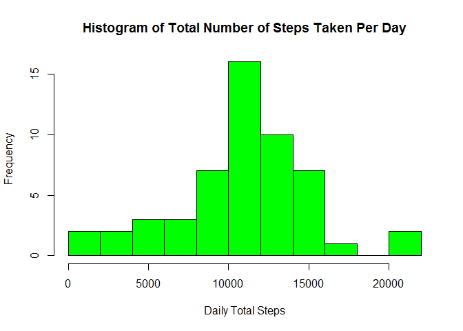
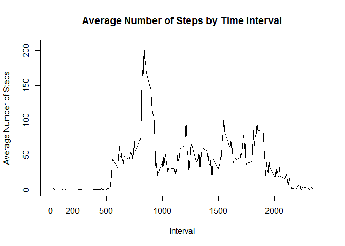
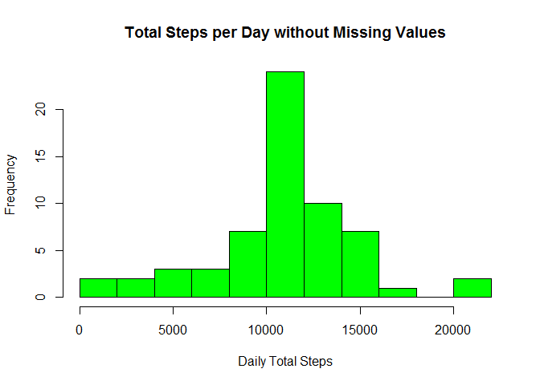
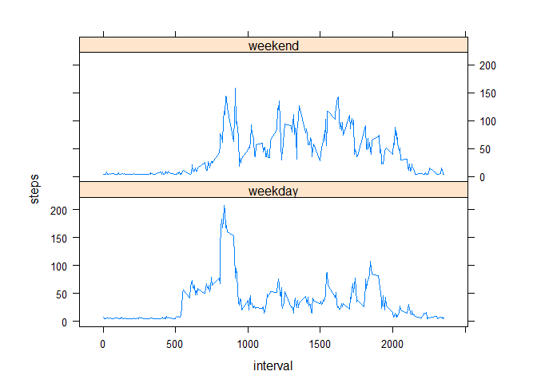

#   Reproducible Research: Peer Assessment 1 - Activity Monitoring  


## Loading and preprocessing the data

```r
datacsv <- read.csv("activity.csv",sep=",", na.strings = c("NA",""),stringsAsFactors = FALSE)
data <- na.omit(datacsv)
```
## What is mean total number of steps taken per day?


```r
Total <- aggregate(steps ~ date, data, sum)
hist(Total$steps, 10,
     main="Histogram of Total Number of Steps Taken Per Day",
     xlab="Daily Total Steps",
     col="Green")
```

 


```r
Total <- aggregate(steps ~ date, data, sum)
MeanTotalSteps = mean(Total$steps)
MedianTotalSteps = median(Total$steps)
```
The mean total number of steps is:

```r
MeanTotalSteps
```

```
## [1] 10766.19
```
The median total number of steps is:

```r
MedianTotalSteps
```

```
## [1] 10765
```

## What is the average daily activity pattern?


```r
IntervalMean <- aggregate(steps ~ interval, data, mean)
```
A plot of the 5-minute interval (x-axis) and the average number of steps taken, averaged across all days (y-axis):

```r
IntervalMean <- aggregate(steps ~ interval, data, mean)
plot(IntervalMean$interval,IntervalMean$steps,
     type="l",
     xlab="Interval", 
     ylab="Average Number of Steps",
     main="Average Number of Steps by Time Interval")
axis(side=1, at=seq(0,max(IntervalMean$steps),by=100))
```

 

The 5-minute interval, on average across all the days in the dataset, that contains the maximum number of steps:

```r
Max <- IntervalMean[IntervalMean$steps==max(IntervalMean$steps),]
```
Max row:

```r
Max
```

```
##     interval    steps
## 104      835 206.1698
```
Which 5-minute interval, on average across all the days in the dataset, contains the maximum number of steps?
Max interval:

```r
Max$interval
```

```
## [1] 835
```

## Inputing missing values
Total number of missing values in the dataset (i.e. the total number of rows with NAs)

```r
sum(is.na(datacsv$steps)|is.na(datacsv$date)|is.na(datacsv$interval))
```

```
## [1] 2304
```

```r
#sum(is.na(datacsv$steps))
```

2.Devise a strategy for filling in all of the missing values in the dataset. The strategy does not need to be sophisticated. For example, you could use the mean/median for that day, or the mean for that 5-minute interval, etc.


```r
data2 <- datacsv

data2$steps[is.na(datacsv$steps)] <- mean(datacsv$steps, na.rm=TRUE)

MeanTotalSteps
```

```
## [1] 10766.19
```


```r
Total2 <- aggregate(steps ~ date, data2, sum, na.rm=TRUE)
MeanTotalSteps2 = mean(Total2$steps)
MedianTotalSteps2 = median(Total2$steps)
```

Histogram of the total number of steps taken each day:


```r
hist(Total2$steps, 10,
     main="Total Steps per Day without Missing Values",
     xlab="Daily Total Steps",
     col="Green")
```

 

The updated mean total number of steps is:

```r
MeanTotalSteps2
```

```
## [1] 10766.19
```
The updated median total number of steps is:

```r
MedianTotalSteps2
```

```
## [1] 10766.19
```

Updating the missing values on the data has made no differnce to the meand and only a very slight difference to the median.

## Are there differences in activity patterns between weekdays and weekends?

- Using the dataset with the filled-in missing values for this part.


```r
# function to detertime the week day type
isWeekend <- function(myDate) {
    day <- weekdays(myDate)
    ifelse (day == "Saturday" | day == "Sunday", "weekend", "weekday")
}

data2$date <- as.Date(data2$date)
data2$day <- weekdays(data2$date)
WeekDayType <- sapply(data2$date, isWeekend)
```

- Created a new factor variable in the dataset with two levels - "weekday" and "weekend" indicating whether a given date is a weekday or weekend day.

```r
data2$weekend <- as.factor(WeekDayType)
```

- Made a panel plot containing a time series plot (i.e. type = "l") of the 5-minute interval (x-axis) and the average number of steps taken, averaged across all weekday days or weekend days (y-axis).

```r
Activity <- aggregate(steps ~ interval + weekend, data2, mean)
library(lattice)
xyplot(steps ~ interval | factor(weekend),
       data=Activity,type="l",
       aspect=1/3)
```

 
